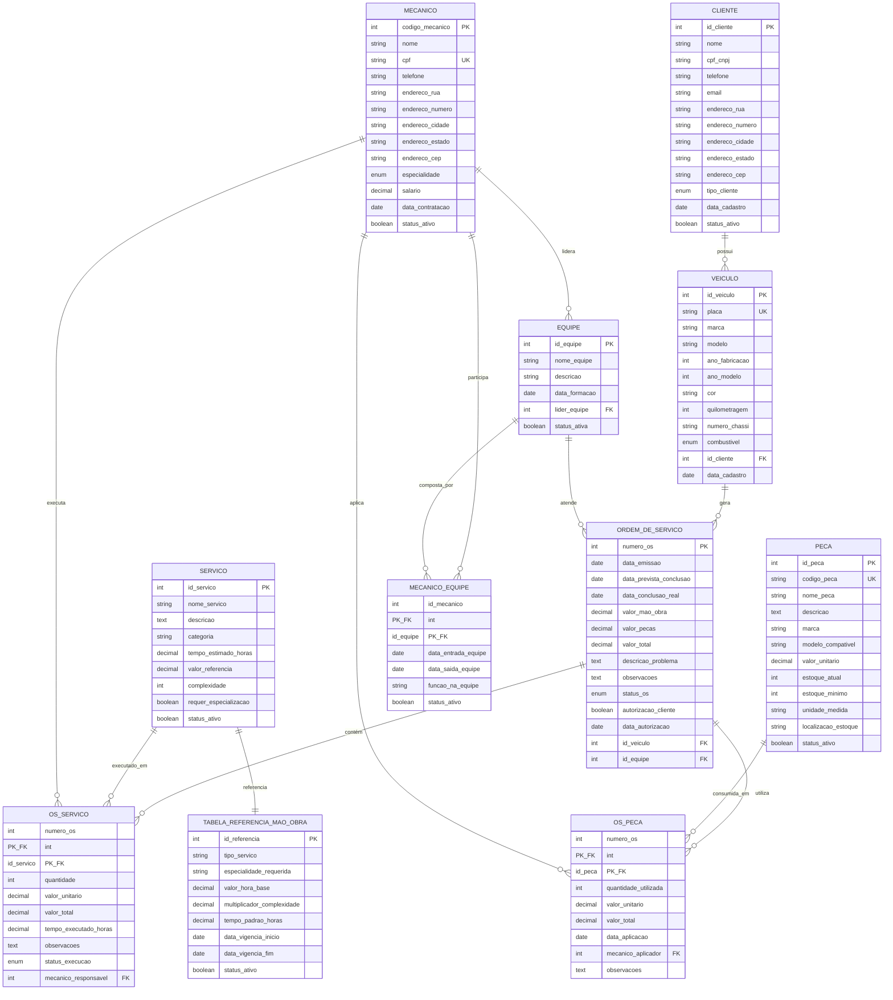

# Sistema de Controle e Gerenciamento de Oficina Mecânica

## 📋 Descrição do Projeto

Este projeto apresenta um esquema conceitual para um sistema de banco de dados destinado ao controle e gerenciamento de execução de ordens de serviço em uma oficina mecânica.

## 🎯 Objetivo

Modelar um banco de dados que permita o controle completo das atividades de uma oficina mecânica, desde o cadastro de clientes e veículos até a execução e finalização das ordens de serviço.

## 📖 Narrativa do Sistema

O sistema deve atender aos seguintes requisitos funcionais:

- **Clientes** levam **veículos** à oficina mecânica para serem consertados ou para passarem por revisões periódicas
- Cada **veículo** é designado a uma **equipe de mecânicos** que identifica os **serviços** a serem executados e preenche uma **OS (Ordem de Serviço)** com data de entrega
- A partir da OS, calcula-se o **valor de cada serviço**, consultando-se uma **tabela de referência de mão-de-obra**
- O **valor de cada peça** também irá compor a OS
- O **cliente autoriza** a execução dos serviços
- A mesma **equipe avalia e executa** os serviços
- Os **mecânicos** possuem código, nome, endereço e especialidade
- Cada **OS** possui: número, data de emissão, um valor, status e uma data para conclusão dos trabalhos

## 🏗️ Entidades Identificadas

### 1. **CLIENTE**
- Representa os proprietários dos veículos que utilizam os serviços da oficina
- **Atributos**: ID, Nome, Telefone, Email, Endereço, CPF/CNPJ

### 2. **VEÍCULO**
- Representa os automóveis que são atendidos na oficina
- **Atributos**: ID, Placa, Marca, Modelo, Ano, Cor, Quilometragem
- **Relacionamento**: Pertence a um CLIENTE

### 3. **MECÂNICO**
- Representa os profissionais que executam os serviços na oficina
- **Atributos**: Código, Nome, Endereço, Especialidade, Telefone, Salário

### 4. **EQUIPE**
- Representa o agrupamento de mecânicos para execução de serviços
- **Atributos**: ID, Nome_Equipe, Data_Formação
- **Relacionamento**: É composta por MECÂNICOS

### 5. **ORDEM_DE_SERVIÇO (OS)**
- Representa o documento que controla a execução dos serviços
- **Atributos**: Número, Data_Emissão, Data_Conclusão, Valor_Total, Status, Autorização_Cliente
- **Relacionamentos**: Relaciona-se com VEÍCULO, EQUIPE, SERVIÇOS e PEÇAS

### 6. **SERVIÇO**
- Representa os tipos de serviços oferecidos pela oficina
- **Atributos**: ID, Descrição, Valor_Mão_Obra, Tempo_Estimado, Categoria

### 7. **PEÇA**
- Representa as peças utilizadas nos serviços
- **Atributos**: ID, Nome, Marca, Valor_Unitário, Estoque_Atual, Estoque_Mínimo

### 8. **TABELA_REFERÊNCIA_MÃO_OBRA**
- Representa a tabela de valores para consulta de preços de mão-de-obra
- **Atributos**: ID, Tipo_Serviço, Valor_Hora, Complexidade

## 🔗 Relacionamentos Principais

1. **CLIENTE** (1:N) **VEÍCULO**
   - Um cliente pode possuir vários veículos, mas cada veículo pertence a um cliente

2. **MECÂNICO** (N:M) **EQUIPE**
   - Um mecânico pode participar de várias equipes, e uma equipe pode ter vários mecânicos

3. **VEÍCULO** (1:N) **ORDEM_DE_SERVIÇO**
   - Um veículo pode ter várias ordens de serviço, mas cada OS é de um veículo

4. **EQUIPE** (1:N) **ORDEM_DE_SERVIÇO**
   - Uma equipe pode atender várias ordens de serviço, mas cada OS é atendida por uma equipe

5. **ORDEM_DE_SERVIÇO** (N:M) **SERVIÇO**
   - Uma OS pode conter vários serviços, e um serviço pode estar em várias OSs

6. **ORDEM_DE_SERVIÇO** (N:M) **PEÇA**
   - Uma OS pode utilizar várias peças, e uma peça pode ser usada em várias OSs

7. **SERVIÇO** (1:1) **TABELA_REFERÊNCIA_MÃO_OBRA**
   - Cada serviço tem uma referência na tabela de mão-de-obra

## 📋 Regras de Negócio Identificadas

1. Todo veículo deve pertencer a um cliente
2. Toda OS deve estar associada a um veículo e uma equipe
3. Uma OS só pode ser executada após autorização do cliente
4. O valor da OS é calculado pela soma dos valores dos serviços e peças
5. Cada mecânico deve ter uma especialidade definida
6. O status da OS deve ser controlado (Pendente, Em Andamento, Concluída, Cancelada)
7. A data de conclusão deve ser posterior à data de emissão
8. Deve haver controle de estoque das peças

## 🔍 Observações e Considerações

- O sistema considera que a mesma equipe que avalia também executa os serviços
- Foi assumido que existe controle de estoque de peças
- Status da OS foi definido como: Pendente, Em Andamento, Concluída, Cancelada
- Especialidades dos mecânicos podem ser: Motor, Suspensão, Freios, Elétrica, Pintura, etc.
- O campo "Autorização_Cliente" na OS indica se o cliente aprovou a execução dos serviços

## 📊 Diagrama Entidade-Relacionamento

### 📋 Legendas do Diagrama

**Símbolos Utilizados:**
- **PK** = Primary Key (Chave Primária)
- **FK** = Foreign Key (Chave Estrangeira) 
- **UK** = Unique Key (Chave Única)
- **PK_FK** = Chave que é tanto Primária quanto Estrangeira

**Cardinalidades dos Relacionamentos:**
- **||--o{** = Relacionamento 1:N (Um para Muitos)
- **||--||** = Relacionamento 1:1 (Um para Um)
- **}o--o{** = Relacionamento N:M (Muitos para Muitos)

**Fluxo Principal do Sistema:**
1. **Cliente** registra **Veículo** na oficina
2. **Equipe** de **Mecânicos** cria **Ordem de Serviço**
3. **Serviços** e **Peças** são adicionados à OS
4. Cliente autoriza a execução
5. **Mecânicos** executam os trabalhos
6. OS é finalizada com valores calculados

## 📊 Arquivos do Projeto

- `README.md` - Este arquivo com a documentação completa
- `esquema_conceitual.md` - Descrição detalhada do esquema conceitual
- `modelo_er.mermaid` - Diagrama Entidade-Relacionamento em formato Mermaid
- `script_ddl.sql` - Script SQL para criação das tabelas (implementação física)
- `consultas_sql.md` - Exemplos de consultas úteis para o sistema
- `glossario_tecnico.md` - Glossário de termos e considerações técnicas

---

**Desenvolvido por**: Adalberto Ribeiro  
**Data**: Outubro 2025  
**Projeto**: Desafio DIO - Esquema Conceitual para Banco de Dados